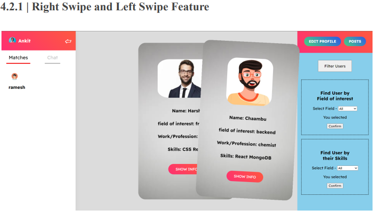
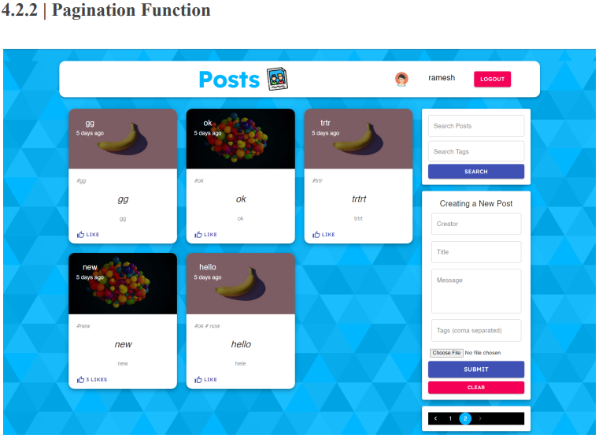

<h1>Match-Making-Web-Application-Squaddle</h1>

Squaddle (Match Making Web Application) platform connects individuals, Students, and freelancers from around the world so that they can connect and help each other with their tasks. This project aims to provide users with a seamless and accessible way to discover potential matches, communicate, and build connections.
<h2>General Information</h2>

<ul>
<li>This is the Full Stack ( MERN ) project. This project is a web application created with the help of HTML, CSS, JavaScript, ReactJS, ExpressJS, MongoDB, NodeJS</li>
</ul><ul>
<li>This project helps people to find partners for their projects or any other tasks</li>
</ul><ul>
<li>Also, this web application helps people to connect with people whom they don't know.</li>
</ul><h2>Technologies Used</h2>

<ul>
<li>HTML</li>
</ul><ul>
<li>CSS</li>
</ul><ul>
<li>JavaScript</li>
</ul><ul>
<li>React</li>
</ul><ul>
<li>NodeJS</li>
</ul><ul>
<li>Express.js</li>
</ul><ul>
<li>MongoDB</li>
</ul>
<h2>ScreenShots Of Application</h2>

<ul>

</ul><ul>

  </ul>
